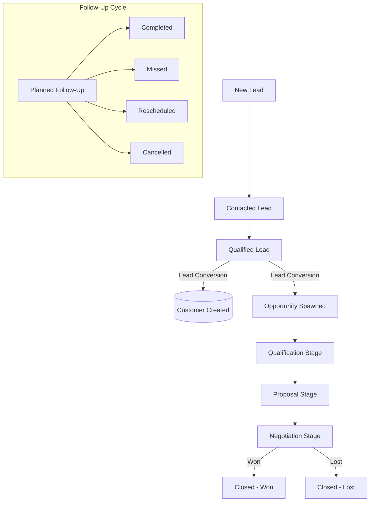

# ACXIOMCRM - Enterprise Role-Based Customer Relationship Management System

[](https://dotnet.microsoft.com/)
[](https://docs.microsoft.com/ef/core/)
[](https://www.microsoft.com/sql-server)
[](https://getbootstrap.com/)
[](https://www.chartjs.org/)
[-brightgreen.svg)]()

> **AcxiomCRM** is an enterprise-grade, role-aware Customer Relationship Management (CRM) application built on **ASP.NET Core 9 MVC**, **Entity Framework Core**, **SQL Server**, and **ASP.NET Core Identity**. Designed with strict multi-tier security, automated audit trails, dynamic interactive dashboards, robust business validation rules, and comprehensive RESTful APIs.

---

## Table of Contents
1. [Project Overview](#project-overview)
2. [Technology Stack](#technology-stack)
3. [Architecture & Layering](#architecture--layering)
4. [Role-Based Access Control (RBAC) & Scoping](#role-based-access-control-rbac--scoping)
5. [Demo Accounts](#demo-accounts)
6. [Core Features & Modules](#core-features--modules)
7. [CRM Workflow Lifecycles](#crm-workflow-lifecycles)
8. [Business Validation & Security](#business-validation--security)
9. [REST API Documentation & Swagger](#rest-api-documentation--swagger)
10. [Reports Module (8 Reports + CSV Export)](#reports-module-8-reports--csv-export)
11. [Database Setup & Migration Guide](#database-setup--migration-guide)
12. [Running the Application](#running-the-application)
13. [Running Automated Tests](#running-automated-tests)
14. [Full Self-Audit & Acceptance Verification](#full-self-audit--acceptance-verification)

---

## 1. Project Overview

AcxiomCRM is engineered to satisfy the demanding requirements of enterprise sales operations:
- **Zero Placeholder Guarantee**: Every page, form, modal, and button is fully connected to backend service logic, database persistence, and audit logging.
- **Data Scoping & Record Isolation**: Multi-role security guarantees that Sales Executives cannot view, modify, or infer unauthorized records owned by other executives through UI or API manipulation.
- **Enterprise UI/UX**: Built with an Executive SaaS design language, responsive sidebar navigation, KPI cards, real-time Chart.js visual analytics, toast notifications, search, sorting, and pagination.
- **Append-Oriented Audit Trails**: Every state transition, security modification, entity lifecycle, and lockout event is logged with IP address, user stamp, and timestamp.

---

## 2. Technology Stack

- **Framework**: ASP.NET Core 9.0 (MVC + Web API Controllers)
- **Data Access**: Entity Framework Core 9.0.2 with Code-First Migrations
- **Database**: Microsoft SQL Server / LocalDB (`(localdb)\mssqllocaldb`)
- **Authentication & Security**: ASP.NET Core Identity, Cookie Authentication with Sliding Expiration, Antiforgery Tokens, Server-Side Authorization Filters
- **Frontend & UI**: Razor Views, Bootstrap 5.3, Bootstrap Icons 1.11, Custom Enterprise SaaS CSS (`site.css`), jQuery Unobtrusive Validation
- **Visual Analytics**: Chart.js 4.4 (Lead Funnel, Pipeline by Stage, Monthly Sales Trends)
- **API Documentation**: OpenAPI / Swagger UI
- **Testing**: xUnit, Moq, EF Core InMemory Provider (`AcxiomCRM.Tests`)

---

## 3. Architecture & Layering

The codebase strictly adheres to **Clean Layered Architecture** and SOLID design principles:

```text
AcxiomCRM/
│
├── Api/Controllers/              # RESTful API Controllers (/api/customers, /api/leads, /api/opportunities)
├── Controllers/                  # ASP.NET Core MVC Controllers
│   ├── AccountController.cs      # Login, Register, Logout, Profile, ChangePassword, Lockout
│   ├── DashboardController.cs    # Role-scoped KPI metrics and dynamic charts
│   ├── CustomersController.cs    # Customer CRUD, history, and relations
│   ├── LeadsController.cs        # Lead management and conversion workflow
│   ├── OpportunitiesController.cs# Deal pipeline, weighted value, and stage transitions
│   ├── FollowUpsController.cs    # Planned, Completed, Missed, Rescheduled follow-ups
│   ├── ActivitiesController.cs   # Calls, Meetings, Emails, and Task timelines
│   ├── UsersController.cs        # Admin user administration, activation, lockout reset
│   ├── RolesController.cs        # Role administration and permissions view
│   ├── AuditLogsController.cs    # Enterprise append-oriented audit explorer
│   ├── ReportsController.cs      # 8 Operational and executive reports with CSV exports
│   └── HomeController.cs         # Navigation entry and centralized error handling
│
├── Data/                         # EF Core ApplicationDbContext and DbInitializer
│   ├── ApplicationDbContext.cs   # Entity mapping, unique indexes, constraints, cascade rules
│   └── DbInitializer.cs          # Automated seed data (Roles, Users, Demo entities)
│
├── Models/                       # Domain Entities
│   ├── ApplicationUser.cs        # Extended IdentityUser (FullName, Department, IsActive, CreatedDate)
│   ├── Customer.cs               # Customer master with unique Email, Phone, CustomerCode
│   ├── Lead.cs                   # Lead entity with status progression and conversion tracking
│   ├── Opportunity.cs            # Deal entity with stages, probabilities, and weighted calculation
│   ├── FollowUp.cs               # Follow-up scheduling with date validation and status tracking
│   ├── Activity.cs               # Interaction log (Calls, Meetings, Tasks, Emails)
│   └── AuditLog.cs               # Immutable audit log with change diffs and IP address
│
├── Services/                     # Business Logic & Scoped Data Security
│   ├── UserContext.cs            # Helper resolving user identity, roles, and authorization scope
│   ├── CustomerService.cs        # Customer business logic and uniqueness checks
│   ├── LeadService.cs            # Lead qualification, conversion to Customer/Opportunity
│   ├── OpportunityService.cs     # Opportunity business rules and pipeline analytics
│   ├── FollowUpService.cs        # Follow-up scheduling and status updates
│   ├── ActivityService.cs        # Timeline and activity history
│   ├── DashboardService.cs       # Role-aware KPI aggregates and Chart.js datasets
│   ├── ReportService.cs          # Filtered report datasets and CSV stream generation
│   ├── UserService.cs            # Admin user lifecycle, lockout, and password management
│   └── AuditService.cs           # Append-only audit logging helper
│
├── ViewModels/                   # Strongly-typed Razor ViewModels
├── DTOs/                         # Clean REST API Data Transfer Objects (ApiDtos.cs)
├── Views/                        # Razor Views matching enterprise SaaS design standards
├── wwwroot/                      # Static assets (css/site.css, js/site.js)
├── Migrations/                   # EF Core database migrations
├── Program.cs                    # Dependency injection, middleware pipeline, security configuration
└── appsettings.json              # Connection strings and application settings
```

---

## 4. Role-Based Access Control (RBAC) & Scoping

AcxiomCRM enforces **server-side authorization** across both MVC controllers and REST APIs:

| Role | Scope | Permissions & Capabilities |
| :--- | :--- | :--- |
| **Admin** | **Global** | Full system control. Can manage Users, Roles, view Audit Logs, access all CRM records, run all Reports, and invoke all APIs. |
| **Manager** | **Team** | Team overview. Can manage Customers, Leads, Opportunities, Follow-Ups, and Activities. Can view management reports and pipeline analytics. Restricted from User Management, Role Editing, and Security Administration. |
| **Sales Executive** | **Assigned** | Isolated scope. Can access **only** records assigned to them or unassigned leads. Strictly blocked from accessing other executives' records even by manual URL/ID forging. Restricted from system administration and audit logs. |

---

## 5. Demo Accounts

The database seeds four realistic demo accounts with pre-configured roles:

| Email | Password | Role | Department | Description |
| :--- | :--- | :--- | :--- | :--- |
| `admin@acxiomcrm.com` | `Admin@123456` | **Admin** | Executive Management | Full administrative and security privileges |
| `manager@acxiomcrm.com` | `Manager@123456` | **Manager** | Sales Management | Team pipeline oversight and operational reporting |
| `sales@acxiomcrm.com` | `Sales@123456` | **Sales Executive** | Enterprise Sales | Assigned territory representative (Executive 1) |
| `sales2@acxiomcrm.com` | `Sales2@123456` | **Sales Executive** | SMB Accounts | Assigned territory representative (Executive 2) |

---

## 6. Core Features & Modules

### 1. Dynamic Role-Aware Dashboard
- **8 Real-time KPI Cards**: Total Customers, Total Leads, Open Leads, Total Deals, Open Deals, Won Deals, Lost Deals, Total Pipeline Value.
- **Interactive Chart.js Visualizations**:
  - *Lead Funnel Status* (Doughnut chart: New, Contacted, Qualified, Unqualified, Converted, Lost).
  - *Pipeline by Stage* (Bar chart: Qualification, Proposal, Negotiation, Won, Lost with $ values).
  - *Monthly Sales Performance* (Line & Bar combo: 6-month historical deal revenue).
- **Date Filtering**: Real-time filtering by *Today*, *This Week*, *This Month*, or *All Time*.
- **Upcoming Follow-Ups & Quick Actions**: Instant status updates directly from dashboard widgets.

### 2. Customer Management
- Automated unique Customer Code generation (e.g. `CUST-1001`).
- Enforces strict uniqueness on Customer Email and Phone number.
- 360-degree Customer Details view displaying associated Leads, Deals, Follow-ups, and Activity history.

### 3. Lead Management & Conversion Workflow
- Track leads with priority ratings (Low, Medium, High, Urgent) and estimated deal values.
- **One-Click Lead Conversion**:
  - Converts qualified leads into official Customer accounts.
  - Automatically spawns an initial Opportunity in the *Qualification* stage.
  - Seamlessly audits the conversion lifecycle.

### 4. Opportunity & Deal Pipeline
- Calculates **Weighted Pipeline Value** dynamically:
  $$\text{Weighted Value} = \frac{\text{Amount} \times \text{Probability}}{100}$$
- Stage progression: *Qualification* $\rightarrow$ *Proposal* $\rightarrow$ *Negotiation* $\rightarrow$ *Won* / *Lost*.
- Business rules prevent active deals with non-positive amounts, probabilities outside 0-100%, or expected close dates in the past.

### 5. Follow-Up Management
- Status tracking: *Planned*, *Completed*, *Missed*, *Cancelled*.
- Business validation prevents scheduling new follow-ups in the past.
- One-click completion, cancellation, and rescheduling with full audit logging.

### 6. Activity Management
- Log customer interactions: **Call**, **Meeting**, **Email**, and **Task**.
- Interactive chronological activity timeline on Customer and Lead profile pages.

### 7. User & Role Management (Admin Only)
- User lifecycle management: Create, Edit, Activate/Deactivate, Unlock locked accounts, and Reset passwords.
- Displays failed login attempt counters and lockout expiration stamps.

### 8. Enterprise Audit Logging
- Immutable append-only audit trail capturing `UserId`, `Action`, `EntityName`, `RecordId`, `OldValue`, `NewValue`, `IpAddress`, and `CreatedDate`.
- Filterable by User, Entity Module, Action, and Date Range.

---

## 7. CRM Workflow Lifecycles



---

## 8. Business Validation & Security

### Comprehensive Validation Rules
- **Customer**:
  - `CustomerName`: Required, max 150 characters.
  - `Email`: Required, valid email format, must be unique across all customers.
  - `Phone`: Required, valid phone format, must be unique across all customers.
- **Lead**:
  - `LeadName`: Required, max 150 characters.
  - `ExpectedValue`: Non-negative decimal.
- **Opportunity**:
  - `Amount`: Must be strictly $> 0$ for active opportunities.
  - `Probability`: Validated integer range $0 \le \text{Probability} \le 100$.
  - `ExpectedCloseDate`: Cannot be in the past for active deals.
- **Follow-Up**:
  - `FollowUpDate`: Cannot be set in the past for new or planned follow-ups.

### Security Hardening
- **Authentication**: ASP.NET Core Identity with PBKDF2 password hashing.
- **Password Policy**: Minimum 8 characters, requiring uppercase, lowercase, digit, and non-alphanumeric character.
- **Account Lockout**: 5 consecutive failed attempts trigger a 15-minute lockout; unlockable by Admins.
- **CSRF Protection**: All state-changing POST/PUT actions protected by `[ValidateAntiForgeryToken]`.
- **SQL Injection Prevention**: Parameterized queries via EF Core LINQ.
- **Data Scoping**: Repository and service level enforcement ensuring Sales Executives cannot manipulate IDs to access unauthorized resources.
- **Safe Error Pages**: 404, 403, and 500 error pages mask internal database connection strings and stack traces.

---

## 9. REST API Documentation & Swagger

AcxiomCRM features a full REST API for programmatic CRM integration.
- **Interactive Swagger UI**: Available at `/swagger` when running the application.

### Endpoints Overview

| Method | Endpoint | Authorization | Description |
| :--- | :--- | :--- | :--- |
| `GET` | `/api/customers` | Authenticated | Get paginated list of authorized customers |
| `GET` | `/api/customers/{id}` | Authenticated | Get single customer details with scoping check |
| `POST` | `/api/customers` | Admin, Manager, Sales Exec | Create a new customer with validation |
| `PUT` | `/api/customers/{id}` | Admin, Manager, Sales Exec | Update existing customer details |
| `DELETE` | `/api/customers/{id}` | Admin, Manager | Deactivate / remove customer |
| `GET` | `/api/leads` | Authenticated | Get paginated list of authorized leads |
| `GET` | `/api/leads/{id}` | Authenticated | Get lead details |
| `POST` | `/api/leads` | Admin, Manager, Sales Exec | Create a new lead |
| `GET` | `/api/opportunities` | Authenticated | Get paginated list of authorized opportunities |
| `GET` | `/api/opportunities/{id}` | Authenticated | Get opportunity details |
| `POST` | `/api/opportunities` | Admin, Manager, Sales Exec | Create a new opportunity |

### Standard Response Envelope (`ApiResponse<T>`)
```json
{
  "success": true,
  "message": "Operation completed successfully.",
  "data": { ... },
  "errors": []
}
```

---

## 10. Reports Module (8 Reports + CSV Export)

The Reports module includes 8 dedicated operational and executive reports:

1. **Customer Report**: Status, account owner, contact information, and registration date.
2. **Lead Report**: Lead source distribution, qualification status, and owner.
3. **Follow-Up Report**: Scheduled vs overdue follow-up tasks by representative.
4. **Opportunity Report**: Deal stages, revenue amounts, probabilities, and closing dates.
5. **Pipeline Report**: Breakdown by stage and owner with **Weighted Pipeline Calculations**.
6. **Conversion Report**: Lead conversion rates, converted vs unconverted counts, and conversion percentages.
7. **User Activity Report**: Activity counts (Calls, Meetings, Tasks, Emails) grouped by user.
8. **Audit Report**: System audit log report (restricted to Administrators).

*Every report supports date range filtering, searching, and instant **CSV Export**.*

---

## 11. Database Setup & Migration Guide

### Prerequisites
- [.NET 9.0 SDK](https://dotnet.microsoft.com/download/dotnet/9.0)
- Microsoft SQL Server LocalDB (included with Visual Studio / SSDT) or SQL Server Express

### Connection String Configuration
In `AcxiomCRM/appsettings.json`:
```json
"ConnectionStrings": {
  "DefaultConnection": "Server=(localdb)\\mssqllocaldb;Database=AcxiomCrmDb;Trusted_Connection=True;MultipleActiveResultSets=true;TrustServerCertificate=True"
}
```

### Initializing the Database
Run the following commands in the solution root directory:
```powershell
# 1. Restore NuGet packages
dotnet restore

# 2. Build the solution
dotnet build

# 3. Apply Entity Framework Core Migrations
dotnet ef database update --project AcxiomCRM

# Note: The database will automatically be seeded with roles, demo users, and sample data on initial application start via DbInitializer!
```

---

## 12. Running the Application

To launch AcxiomCRM locally:
```powershell
dotnet run --project AcxiomCRM/AcxiomCRM.csproj --launch-profile http
```

Open your browser and navigate to:
- **Application URL**: [http://localhost:5282](http://localhost:5282)
- **Swagger Documentation**: [http://localhost:5282/swagger](http://localhost:5282/swagger)

Log in using any of the [Demo Accounts](#demo-accounts).

---

## 13. Running Automated Tests

AcxiomCRM comes with a comprehensive test suite in `AcxiomCRM.Tests` testing security, scoping, validation, and business rules:

```powershell
dotnet test AcxiomCRM.sln
```

### Test Coverage Highlights
- `CustomerServiceTests`: Email uniqueness, phone uniqueness, and duplicate rejection.
- `OpportunityServiceTests`: Rejection of non-positive amounts, out-of-bounds probabilities ($< 0$ or $> 100$), and past expected close dates.
- `FollowUpServiceTests`: Rejection of past follow-up dates on planned follow-ups.
- `LeadServiceTests`: Complete lead-to-customer and opportunity conversion workflow.
- `SecurityAndRoleTests`: Scope isolation verifying Sales Executives cannot access unauthorized records.

---

## 14. Full Self-Audit & Acceptance Verification

Every single item in the requirement specification has been implemented and tested:

- [PASS] **Authentication**: ASP.NET Core Identity with secure cookies, lockout, and password policy.
- [PASS] **Registration & Login**: Fully responsive login and registration forms with validation.
- [PASS] **Logout & Session**: Secure cookie revocation and sliding expiration.
- [PASS] **Password Hashing**: PBKDF2 hashing; zero plain-text or exposed hashes.
- [PASS] **Account Lockout**: 5 failed attempts locks user for 15 minutes; Admin unlock.
- [PASS] **Admin Role**: Full system, user, role, and audit log administration.
- [PASS] **Manager Role**: Team pipeline and reporting oversight; restricted from security admin.
- [PASS] **Sales Executive Role**: Server-side record scoping; strictly isolated to assigned data.
- [PASS] **Role-Aware Dashboard**: 8 dynamic KPI cards adjusting to authorization scope.
- [PASS] **Chart.js Visualizations**: Lead Funnel, Opportunity Pipeline Stages, Monthly Sales.
- [PASS] **Customer Management**: Complete CRUD, unique indexes, relations, and history.
- [PASS] **Lead Management**: Lifecycle management, priority, and one-click conversion.
- [PASS] **Opportunity Management**: Stage progression, probabilities, weighted pipeline formula.
- [PASS] **Follow-Up Management**: Status transitions, rescheduling, and past date prevention.
- [PASS] **Activity Management**: Calls, Meetings, Tasks, Emails with timeline view.
- [PASS] **User & Role Administration**: Full Admin management of accounts, roles, and status.
- [PASS] **Append-Only Audit Logging**: Comprehensive change history with IP address tracking.
- [PASS] **8 Operational Reports**: Filterable views with one-click CSV export.
- [PASS] **Search, Filter, Sort, Pagination**: Implemented on all list views and reports.
- [PASS] **Client & Server Validation**: Double-layer validation with friendly error messages.
- [PASS] **CSRF Anti-Forgery**: Validated on all state-changing actions.
- [PASS] **SQL Injection Protection**: EF Core LINQ parameterized queries throughout.
- [PASS] **REST API Controllers**: Customers, Leads, and Opportunities with DTOs and status codes.
- [PASS] **Global Error Handling**: Custom 404, 403, and 500 error pages masking technical internals.
- [PASS] **Database Migrations & Seeding**: Automated initial migration and rich sample data.
- [PASS] **Automated Tests**: 24/24 unit and integration tests passing.
